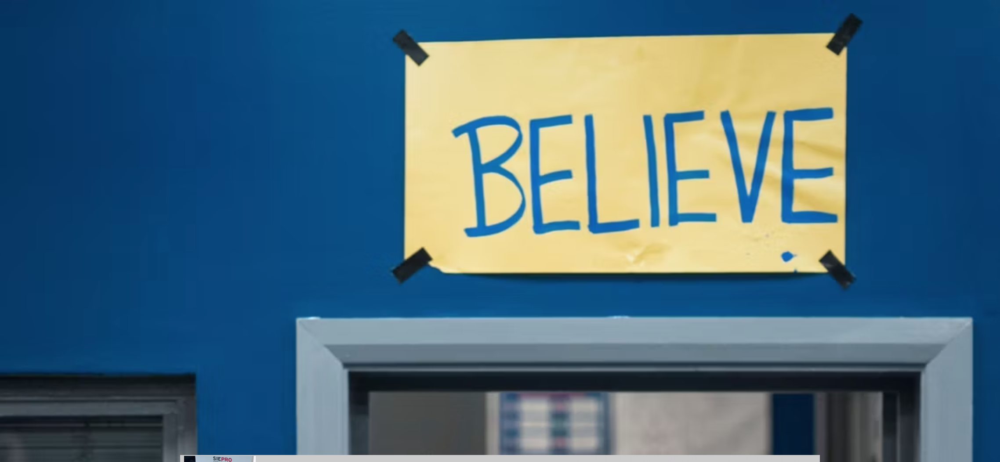

# Learning GitHub and Markdown
[Markdown Cheatsheet](https://www.markdownguide.org/cheat-sheet/)

## substitle superfresh

### Ordered list
1. First Item
2. Second Item
3. Third Item

### Unordered list
- First Item
- Second Item

`codegoes here how are youdoin` `ewdiuhefhewf`

[Google](https://www.google.com)
 Add a word

## image

## Uploaded image

